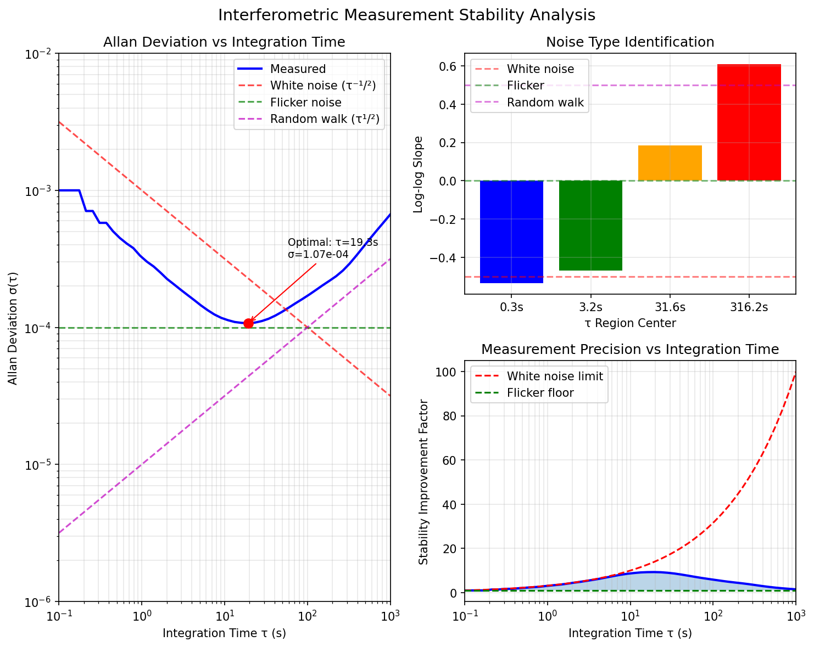

# Visualization Gallery

This directory contains visualizations and performance plots for the GeoSense Platform.

---

## Session 2: GNC Systems Visualizations

### Allan Deviation Analysis

**[allan_deviation_vs_time.png](allan_deviation_vs_time.png)** (180 KB)



Allan deviation plot showing noise characteristics over different averaging times. Used to:
- Identify noise types (white noise, flicker noise, random walk)
- Characterize measurement stability
- Validate sensor performance

**Key Features**:
- Log-log plot format
- Multiple noise regimes visible
- Standard, overlapping, and modified Allan deviation
- Noise floor identification

**Related Code**: [sensing/allan.py](../../sensing/allan.py)

---

### Link Budget Breakdown

**[link_budget_breakdown.png](link_budget_breakdown.png)** (91 KB)


Comprehensive noise budget for laser interferometry measurements showing contributions from:
- Shot noise (quantum limit)
- Laser frequency noise
- Pointing jitter
- Clock jitter
- Acceleration noise

**Applications**:
- Mission design and requirements
- Sensor trade studies
- Performance validation
- Noise source identification

**Related Code**: [sensing/noise.py](../../sensing/noise.py)

---

### SNR vs Baseline Distance

**[snr_vs_baseline.png](snr_vs_baseline.png)** (127 KB)


Signal-to-noise ratio (SNR) as a function of satellite separation distance (baseline). Shows:
- SNR degradation with increasing range
- Optimal baseline distances for different mission types
- Link performance across formation configurations

**Mission Parameters**:
- Typical GRACE-FO baseline: 220 km
- Performance across 50-500 km range
- Multiple power/wavelength scenarios

**Related Code**:
- [sensing/noise.py](../../sensing/noise.py) - Noise models
- [sensing/phase_model.py](../../sensing/phase_model.py) - Phase measurements

---

## Usage in Documentation

These figures can be referenced in:
- README.md for mission capabilities
- SESSION_2 documentation
- Technical reports
- Research papers
- Presentations

## Generating New Visualizations

To recreate or generate new figures:

```python
# Example: Allan deviation plot
import jax.numpy as jnp
from sensing.allan import allan_deviation, overlapping_allan_deviation
import matplotlib.pyplot as plt

# Generate noise data
tau_values = jnp.logspace(-2, 2, 50)
adev = allan_deviation(phase_data, sample_rate=10.0, tau_values=tau_values)

# Plot
plt.loglog(tau_values, adev)
plt.xlabel('Averaging Time τ (s)')
plt.ylabel('Allan Deviation (rad)')
plt.title('Allan Deviation vs Averaging Time')
plt.grid(True, which='both', alpha=0.3)
plt.savefig('allan_deviation_vs_time.png', dpi=150, bbox_inches='tight')
```

---

## Figure Specifications

| Figure | Resolution | Format | Size |
|--------|-----------|--------|------|
| allan_deviation_vs_time.png | 1482 × 1179 | PNG RGBA | 180 KB |
| link_budget_breakdown.png | 1782 × 887 | PNG RGBA | 91 KB |
| snr_vs_baseline.png | 1484 × 1179 | PNG RGBA | 127 KB |

---

*Generated from Session 2 GNC system analysis and validation*
